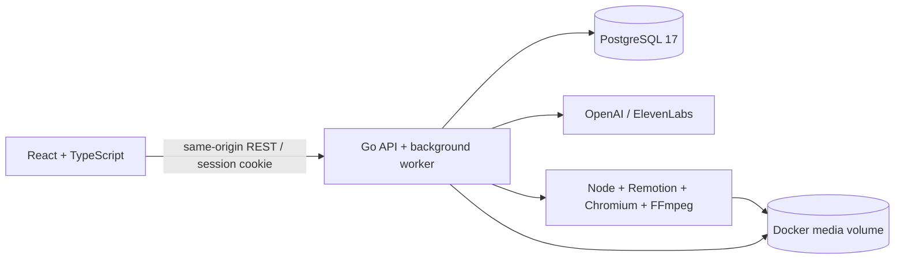

# Sana Quest

**От короткой потребности бизнеса до понятной задачи и проверенного результата команды.** MVP для HackAlem / AI Sana, команда LEXUS.

Пиксельный мир и спокойный рабочий интерфейс. Заказчик уточняет идею с ИИ, подтверждает сведения и публикует задачу с прозрачной готовностью. Команды выбирают задачи сами. Бизнес вручную принимает одну, несколько или ни одной команды. После результата появляются проверенный отзыв и XP.

## Запуск для аудитора

Нужны только **Docker Engine / Docker Desktop и Docker Compose 2.24+**. Личные аккаунты и API-ключи не нужны.

```bash
docker compose up --build -d
```

Открыть **http://localhost:8080**. Первый запуск скачивает образы и собирает приложение, включая видеорендерер. Проверка:

```bash
docker compose ps
curl http://localhost:8080/api/health
```

Оба сервиса должны быть `healthy`. Порт 8080 — интерфейс, 5434 — PostgreSQL для локальной разработки. Порты привязаны только к `127.0.0.1`.

В правом верхнем углу нажмите **«Войти в демо»**. Профили:

| Профиль | Роль | Для чего |
|---|---|---|
| Alem Coffee | Заказчик | Создание задач, публикация, выбор и оценка команд |
| Green Step | Заказчик | Проверка разграничения доступа |
| Pixel Pioneers и ещё 4 команды | Команда | Просмотр, отклик, подтверждение изменённой версии, сдача |

Seed автоматически и однократно создаёт 5 черновиков, 5 опубликованных карточек, 5 команд и 5 предложений. Все исходные данные синтетические. Перезапуск контейнеров сохраняет задачи и медиа в Docker volumes.

```bash
docker compose down          # остановка с сохранением данных
docker compose logs --tail=80 app
```

Удаление volumes через `docker compose down -v` сбрасывает ВСЕ локальные данные. Для обычного перезапуска это не требуется.

## Что работает

- RU / KK / EN интерфейс; язык содержания задачи независим от языка меню.
- Свободная идея → минимум 3 вопроса → редактируемая карточка → подтверждение разделов → финальный предпросмотр → публикация.
- Можно опубликовать короткую потребность с **0 баллов**. Она остаётся в каталоге и доступна для откликов.
- Поиск, фильтры направления и готовности, сортировка по баллам и дате; простое сопоставление с навыками команды.
- Неизменяемые опубликованные версии, сравнение «было / стало», история применённого предложения ИИ. Черновые изменения видны только владельцу.
- Уведомления об изменениях и модальное сравнение при открытии затронутой задачи. Кэшируемый анализ ИИ подсказывает, что пересмотреть в плане. Старое предложение не переписывается: команда подтверждает актуальную версию самостоятельно.
- Идея решения, план, срок, ссылка на прототип; ручной выбор нескольких команд, отклонение, подтверждение этапа и финальная сдача.
- Каталог команд, навыки, университет, XP, уровень, завершённые задачи, отзывы. Оценку ставит заказчик после отправленного результата; повторный отзыв запрещён.
- Голосовая запись и загрузка аудио → распознавание → редактирование транскрипта → использование. Озвучивание текста без автозапуска. API опционален.
- Персональное видео из утверждённой версии: сценарий, язык, длительность, голос, раскадровка, **пробные 30 секунд**, согласование полного MP4, субтитры VTT.
- Демонстрационная подписка Pro. Реального эквайринга и списаний нет. Подписка не даёт баллов рейтинга.
- Адаптивный интерфейс, управление клавиатурой, подписанные формы, нативные диалоги, увеличенный текст, повышенный контраст, reduced motion.

## Прозрачная формула

Баллы вычисляет Go-сервер, не LLM и не браузер. Подтверждение хранит SHA-256 нормализованного текста. Изменение текста снимает подтверждение. Пустое поле не приносит баллов.

| Подтверждённый раздел | Баллы |
|---|---:|
| Контекст **и** потребность | 20 |
| Данные и материалы | 20 |
| Ожидаемый результат | 15 |
| Критерии успеха | 15 |
| Ограничения | 10 |
| Пользователи | 10 |
| Контакт **и** формат взаимодействия | 10 |

0–39: требует уточнений; 40–69: рабочая; 70–89: готовая; 90–100: приоритетная. Подтверждение — ответственность заказчика; балл означает заполненность согласованных сведений, а не независимую проверку их истинности. Текстовая валидация не подменяется субъективной оценкой модели.

Команда получает **+50 XP** за однократно подтверждённый этап и **+150 XP** за принятый финальный результат. Уровень: `floor(XP / 200) + 1`. Рейтинг команды — среднее оценок заказчиков; без отзывов отображается «—». Он отделён от готовности задачи и опыта.

## ИИ и голос

Без `.env` приложение работает с честно обозначенным локальным помощником: сохраняет исходную потребность и задаёт вопросы, не выдумывая ответы. Ввод произвольного аудио требует провайдера; вместо вымышленной транскрипции показывается ограничение. Системное озвучивание браузером доступно при наличии голосов устройства.

Для реальных API скопируйте `.env.example` в `.env` и заполните ключи локально. Уже существующий `.env` перезаписывать не нужно.

```dotenv
OPENAI_API_KEY=...
ELEVENLABS_API_KEY=...
OPENAI_MODEL=gpt-4o-mini
ELEVENLABS_VOICE_ID=JBFqnCBsd6RMkjVDRZzb
```

Поддерживаются также `OPEN_API_KEY`, `11LABS_API_KEY`, `11LABS_KEY`. После изменения ключей: `docker compose up -d --force-recreate app`.

Ключи читаются только сервером; не попадают в frontend, Git или Docker image. API поддерживает OpenAI Responses со строгой JSON Schema, OpenAI STT/TTS и ElevenLabs Scribe v2 / Eleven v3. При наличии ElevenLabs голосовые запросы идут туда, иначе в OpenAI. Выбор языка голоса **не переводит** содержание: сценарий нужно проверить на выбранном языке.

Одна генерация карточки ограничена 2200 выходными токенами. Пользовательский лимит платных вызовов — 40 в сутки на процесс; это защита демо, не промышленный биллинг. Видео не вызывает LLM заново: использует подтверждённый сценарий и фиксированные компоненты. Голос кэшируется, повторный финальный рендер его не оплачивает. Сценарий: 20–1800 символов, до 6 абзацев, до 400 символов на абзац; видео 30 / 45 / 60 / 90 секунд. Длинную озвучку не обрезаем: просим сократить текст или увеличить длительность.

Полный промпт, схема и обработка ошибок — [server/ai.go](server/ai.go). Локальный ответ также возвращает использованный промпт для проверки.

## Архитектура



- `server/` — HTTP, роли, проверки владельца, рейтинг, версии, уведомления, AI/audio и очередь видео.
- `web/` — React 19 + TypeScript + Vite, Lucide, три локализации, адаптивный интерфейс.
- `renderer/` — Remotion 4, адаптация `anything2explainer`, безопасные параметризованные сцены. Пользовательский код не исполняется.
- `docs/` — фактическая архитектура, сценарий защиты, проверка и источники ассетов.
- `hackalem-manual/` — исходное ТЗ и предварительный анализ. Детали первоначального архитектурного плана, не перечисленные здесь, не считаются реализованными.

Для MVP данные представлены одним версионируемым JSONB-агрегатом в PostgreSQL. Все изменения идут в транзакции с блокировкой строки; `revision` предотвращает перезапись из устаревшей вкладки. Это осознанный компромисс для локального аудита и одного экземпляра приложения, не схема для масштабного marketplace. Фоновый видеопроцесс последователен; внешние вызовы выполняются вне транзакции. После сбоя рендера сохранённая задача получает статус ошибки и доступна для повтора. Завершённое старое видео сохраняет номер версии.

## Проверки

```bash
go test -race ./server
npm --prefix web ci
npm --prefix web run build
SANA_URL=http://localhost:8080 python3 scripts/smoke.py
```

`smoke.py` создаёт отдельную QA-задачу и проводит 19 API-проверок. Запускайте его на демонстрационной базе, а не на реальных данных.

Браузерные проверки:

```bash
cd web
npx playwright install chromium
npm run test:e2e
cd ..
SANA_URL=http://localhost:8080 node scripts/browser-flow.cjs
```

При уже установленном Chromium можно задать `CHROME_EXECUTABLE=/absolute/path/to/chromium`. В браузерном сценарии создаётся ещё одна QA-задача. Проверяются пользовательский путь, 3 языка, ширины 320–1440 px, клавиатура и автоматические правила axe. Это не сертификация WCAG и не замена ручной проверки со скринридером.

## Разработка без полной пересборки

Нужны Go 1.24+, Node 22+ и работающая база:

```bash
docker compose up -d db
npm --prefix web ci
npm --prefix web run build
go run ./server
```

В другой вкладке: `npm --prefix web run dev` (http://localhost:5173, API проксируется на 8080). Перед запуском Go остановите контейнер app, занимающий тот же порт. Для локального видеорендера дополнительно нужны Chromium, FFmpeg и `npm --prefix renderer ci && npm --prefix renderer run bundle`. Docker включает их автоматически.

## Границы MVP и лицензии

Демо-вход намеренно заменяет регистрацию, пароли и реальную оплату. Для внешнего размещения потребуются настоящая аутентификация, TLS, платёжный провайдер, постоянные квоты, политика данных и отдельные таблицы/очередь. `DEMO_MODE=false` отключает выбор демопрофилей, но само по себе не создаёт production-auth.

`anything2explainer` используется в видеоадаптере с сохранением уведомлений и [лицензии](renderer/ANYTHING2EXPLAINER-LICENSE). Его toolkit имеет **PolyForm Noncommercial**: для коммерческого использования автор требует предварительное разрешение. Поэтому Pro здесь является демонстрацией тарифа, не действующим коммерческим сервисом. У Remotion отдельные [условия лицензирования](https://www.remotion.dev/license).

Оригинальный баннер сгенерирован через встроенный imagegen; [промпт и происхождение](docs/assets.md). Проверенные сценарии и оставшиеся ограничения: [docs/verification.md](docs/verification.md). Защита до 5 минут: [docs/demo.md](docs/demo.md).
