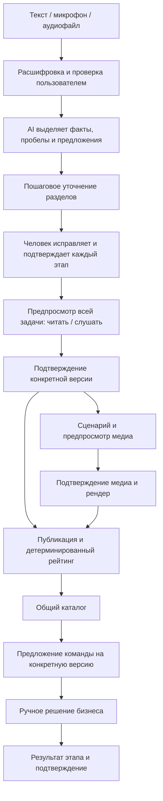
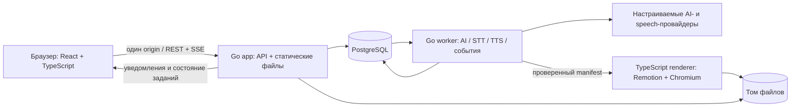

# AI Sana Challenge Hub: архитектура и пайплайн v2

Дата: 23.09.2026. Статус: проектирование, приложение ещё не реализовано. Этот документ заменяет рекомендации по стеку и объёму первой версии из `strategy-and-plan.md`.

## 1. Принятые требования и продуктовый принцип

Обязательный стек по запросу пользователя: **Docker, Go, PostgreSQL, TypeScript**. В первой версии: русский, казахский и английский для интерфейса, голосового ввода и озвучки. Все обязательные функции исходного кейса сохраняются: вопросы, редактируемая карточка, ручное подтверждение, прозрачный рейтинг, открытый каталог, отклики и ручной выбор команд.

Расширение: пошаговый AI-помощник с подтверждением каждого этапа; исходный текст, запись с микрофона и загрузка аудио; история формирования и изменения задачи; сравнение версий; уведомление студентов; текстовое, аудио- и видеопредставление утверждённых требований. Для видео пользователь выбрал изучить и использовать skill `anything2explainer`.

Уточнение пользователя: видео генерируется в самом конце, индивидуально для каждого заказчика из его согласованной потребности; используются OpenAI и ElevenLabs. Ключ ElevenLabs пользователь добавляет самостоятельно. Целевые имена конфигурации: `OPENAI_API_KEY` и `ELEVENLABS_API_KEY` (предложенное пользователем `11LABS_API_KEY` начинается с цифры и не подходит как обычное имя shell-переменной/Compose-интерполяции). Ключи во время проектирования не читались и не проверялись.

**Основная единица продукта — утверждённая версия требований.** Карточка, озвучка, видео, перевод и предложение студента имеют явную ссылку на неё. AI создаёт предложения, пользователь принимает решения, сервер фиксирует согласованное состояние.

Доступность — свойство всех экранов, включая каталог, формы, ошибки и согласования. Наличие микрофона и TTS само по себе не означает доступность для незрячего пользователя. Разные форматы позволяют выбрать подходящий способ работы; мы не утверждаем существование фиксированных «типов обучения» или измеренного выигрыша без исследования.

## 2. Пользовательский пайплайн



Публикация текста не зависит от завершения видео. В предпросмотре две ясные возможности: «Опубликовать задачу» и «Подготовить видео». Видео можно добавить позже к той же версии. Не требовать видео, идеального рейтинга или заполнения неизвестных фактов для публикации.

### Этапы помощника

1. **Проблема:** что происходит сейчас, что мешает, что хочется изменить.
2. **Люди:** пользователи, их сценарий, кто взаимодействует с решением.
3. **Результат:** ожидаемый артефакт, критерии приёмки, проверяемые показатели.
4. **Условия:** данные, материалы, ограничения, сроки, доступы, контакт и обратная связь.
5. **Общий предпросмотр:** все сведения, неизвестное, рейтинг, источник и согласование.

На каждом этапе доступны ввод текстом/голосом, прочтение или прослушивание, исправление и явное подтверждение. Минимум три уместных уточняющих вопроса обязательны по ТЗ. Не спрашивать повторно то, что уже сообщено: предзаполнить и предложить проверить.

Незнание допустимо: «Пока не знаю» сохраняется как `unknown`, не превращается в факт и не приносит баллов. Можно подтвердить, что раздел пока неполон. Отдельное поле `reviewed` не равно `complete`.

### Голосовое согласование

Голосовая работа доступна на всех этапах, включая исправление расшифровки и предпросмотр. Команды «подтвердить», «изменить», «повторить», «назад» распознаются только в явном режиме команд. Аудио исходного задания никогда не исполняется как команда интерфейса. Перед публикацией система озвучивает, какую версию и какое действие пользователь подтверждает; команда действует только для текущего контекста. Кнопки с клавиатурой и экранным диктором остаются равноправным способом.

Исправление голосом: «В сроке замени две недели на три» → сервер формирует patch → пользователь слышит/видит изменение → подтверждает. Модель не применяет команду напрямую к опубликованной версии.

## 3. Архитектура развёртывания

Рекомендация: модульное Go-приложение с отдельными процессами фоновых заданий и рендеринга. Общая доменная модель и один PostgreSQL. Усложнение в виде Kafka, Kubernetes, отдельной векторной БД и множества бизнес-микросервисов здесь не даёт необходимой пользы.



### Docker Compose

| Сервис | Ответственность |
| --- | --- |
| `app` | Go HTTP API, встроенный через `go:embed` production build интерфейса, защищённая выдача медиа, SSE |
| `worker` | Тот же Go-код домена, обработка AI/аудио, outbox, повторные попытки и запуск рендера |
| `renderer` | Node/TypeScript, Remotion, headless Chromium и медиазависимости; внутренний API без публичного порта |
| `db` | PostgreSQL, постоянный том данных, healthcheck |
| `bootstrap` | Одноразовый Go-процесс миграций и начальных демоданных; завершается до запуска app/worker |

Один адрес аудитора: `http://localhost:8080`. Публично пробрасывается только app и по умолчанию только на loopback. Production build фронтенда собирается в Docker; локальные Node, Go, PostgreSQL и Python аудитору не нужны. Renderer получает собственный лимит ресурсов, чтобы видео не блокировало каталог и формы.

Планируемая команда после реализации:

```sh
docker compose up --build
```

**Сейчас эта команда не готова к исполнению: compose и приложение предстоит создать.** Целевой контракт: установка только Docker с Compose, миграции и seed автоматически, отсутствие обязательного `.env` для демонстрационного режима. Первой сборке нужен интернет для образов/пакетов; работа без сети обещается только после сборки и наличия локальных данных. Измерить фактическое время запуска и ресурсы на чистом окружении; не обещать произвольную «одну минуту».

Порядок: `db healthy` → `bootstrap completed successfully` → `app/worker`; app имеет отдельные `/health/live` и `/health/ready`. Не ждать внешнего AI в readiness основного приложения: показывать доступные возможности отдельно. Bootstrap идемпотентен, повторный запуск не сбрасывает работу. Renderer может отказать независимо; ядро остаётся готовым.

Docker Compose различает запуск контейнера и готовность сервиса; порядок и healthcheck основаны на [официальной документации](https://docs.docker.com/compose/how-tos/startup-order/). Образы/версии и lock-файлы фиксируются при реализации, без `latest` и скачивания новых инструментов во время запроса пользователя. Поддержку amd64/arm64 renderer необходимо реально проверить и описать.

### Компоненты внутри приложения

- Frontend: React + TypeScript + Vite, маршрутизация, серверное состояние, формы; `ru/kk/en` словари с единым набором ключей, локальные шрифты с казахскими символами.
- Backend: Go, HTTP handlers, доменные сервисы, `pgx`, SQL-миграции; OpenAPI-контракт и сгенерированные TS-типы.
- Доменные модули: identity/demo sessions, requirements, approvals, scoring, catalog, proposals, milestones, media, notifications.
- PostgreSQL: транзакционные данные, JSONB-снимки требований, очередь jobs и outbox. Бинарное аудио и видео находятся в файловом томе, а в БД — метаданные и права.
- Локальное хранилище через интерфейс `ObjectStore`; для последующего размещения — S3-совместимая реализация. MinIO не обязателен для первого запуска.
- Журналы процессов: структурированные записи с request/job ID и без секретов. Пользовательская история изменений — отдельная сущность, не вывод системных логов.

## 4. Модель данных и правила версий

| Сущность | Основные данные / инвариант |
| --- | --- |
| `users`, `teams`, `team_memberships` | Демороли, участники, права; навыки и интересы без чувствительных признаков |
| `challenges` | Владелец, тема, `published_version_id`, текущий рабочий draft |
| `drafts` | Изменяемый workspace, `base_version_id`, `revision`, структура полей и неизвестного |
| `source_items` | Исходный текст, ID аудио, подтверждённая расшифровка, язык, владелец и видимость |
| `ai_proposals` | Предложенные значения/patch, ссылки на источники, статус принятия, версия контракта/промпта |
| `section_approvals` | Раздел, пользователь, hash содержимого и зависимостей, подтверждение, актуальность |
| `challenge_versions` | Неизменяемый snapshot, номер версии, source language, подтверждение, баллы, breakdown и версия формулы |
| `change_sets` | Между какими версиями, детерминированный diff, краткое AI-объяснение и его статус проверки |
| `localized_briefs` | Перевод snapshot, `ru/kk/en`, hash, `machine/reviewed`, ссылка на исходную версию |
| `proposals`, `proposal_revisions` | Идея/план/срок/ссылка, команда, версия ТЗ, статус; обновление предложения явно подтверждает команда |
| `milestones`, `progress_awards` | Результат выбранной команды, решение бизнеса; уникальность начисления за этап |
| `media_scripts` | Сценарий, язык, версия ТЗ/перевода, утверждение, voice/style и hashes |
| `media_assets` | Вид, путь, источник-версия, hash, статус, язык, длительность, видимость, license/provenance |
| `jobs` | Вид работы, входной hash, попытка, lease, состояние, результат и безопасная ошибка |
| `outbox`, `notifications`, `version_receipts` | Надёжные события публикации, адресаты, прочтение версии; подтверждение прочтения не равно принятию новых условий |
| `audit_events` | Кто предложил/изменил/подтвердил/опубликовал, время и версия; пользовательское объяснение без секретов |

### Подтверждение действительно только для показанного содержимого

У раздела состояния `empty → proposed → reviewed/confirmed`; изменение фактов или зависимостей делает затронутые подтверждения `needs_review`. Hash привязан к полям и их зависимостям, а не только к номеру шага. Например, изменение аудитории требует повторной проверки сценария использования и критериев успеха, но не обязательно контактного email.

Зависимости задаются явно в коде. AI может предложить дополнительные затронутые разделы, но не определяет единолично, какие подтверждения действительны. Неизвестные поля можно осознанно оставить неизвестными; оценка не повышается за само нажатие «подтверждаю».

Публикация выполняется одной транзакцией: проверка прав и `revision` → проверка актуальности подтверждений → immutable snapshot → расчёт рейтинга → `published_version_id` → change set/outbox/audit. Счёт вычисляется на сервере из подтверждённого исходного ТЗ; переводы и красивые медиа не меняют балл. Прежние опубликованные версии сохраняются.

Запрос из устаревшей вкладки возвращает `409 VERSION_CONFLICT` с возможностью сравнить изменения; не перезаписывает новую редакцию. Повторная публикация с тем же idempotency key не создаёт дубль.

## 5. Что происходит, когда заказчик меняет задачу

1. Заказчик начинает новую редакцию на основе опубликованной v1. Студенты продолжают видеть v1; несогласованные черновики и приватные ответы не раскрываются.
2. AI показывает предложения и влияния: какие пункты меняются, какие ответы нужно уточнить. Старые подтверждения затронутых разделов снимаются.
3. Заказчик проверяет изменения и подтверждает новую v2. После публикации обновляются рейтинг и каталог.
4. Подписчики, авторы откликов и выбранные команды получают уведомление v1 → v2. Событие сохраняется в БД даже при закрытом браузере.
5. При первом открытии обновлённой задачи или попытке продолжить отклик показывается доступное окно «Заказчик обновил задачу». Фоновое событие в другой части интерфейса показывает ненавязчивый баннер и не крадёт фокус.
6. В окне: что изменилось, старое/новое, возможное влияние на план, ссылка на источник и способы прочитать/прослушать изменения. Действия: «Посмотреть изменения», «Обновить мой отклик», «Позже».
7. «Ознакомился» фиксирует чтение версии, но не согласие команды выполнить новый объём. К существующему отклику остаётся прикреплена v1; обновление на v2 выполняется отдельным действием команды. Выбор команды бизнесом также не меняется автоматически.
8. Аудио и видео v1 не исчезают из истории, но в текущем представлении помечаются устаревшими. Новая генерация привязывается к v2; старый завершившийся job не может занять место актуального медиа.

Пример: было «веб-учёт заявок, пилот через 14 дней», стало «добавить экспорт CSV, пилот через 21 день». Уведомление перечисляет конкретные изменения. AI может предложить поправить план команды; срок, обязанности и согласие команды не меняет сам.

Опечатки и существенные изменения можно различать для интенсивности уведомлений, но любое изменение опубликованного содержимого получает новую версию. Изменения срока, результата, пользователей, данных, критериев успеха и ограничений считаются существенными по явным правилам; AI не может скрыть их как «незначительные».

## 6. AI, аудио и языки

### AI-адаптеры

Контракты: `AnalyzeDraft`, `SuggestQuestions`, `ProposeSection`, `ExplainDiff`, `TranslateBrief`, `PrepareNarration`. Ответы соответствуют JSON Schema и проверяются Go-сервером. Выход содержит поля, `source_ids`, отсутствующие сведения и предположения отдельно. Ссылки на источники проверяются, но сама ссылка не доказывает смысловую верность; пользователь видит исходный фрагмент и принимает решение.

LLM не пишет в БД публикации напрямую, не меняет балл, не выбирает команду, не исполняет текст пользователя как инструкции и не генерирует исполняемый код для renderer. Для объяснения diff модель получает только разрешённые обе версии и серверный diff. Никакого внешнего веб-обогащения требований без отдельного решения пользователя.

### Аудиоввод

`запись / файл → загрузка → проверка типа/размера/длительности → нормализация → STT → редактируемая расшифровка с сегментами → проверка человеком → source_item → AI`.

Запись: `getUserMedia` + `MediaRecorder`, с явными «Начать», «Пауза», «Остановить», «Прослушать», «Удалить», «Отправить». Выбирать MIME через проверку поддержки браузером, не предполагать один формат. Запрос микрофона только по действию пользователя; состояние и длительность видимы и доступны диктору. Ошибка разрешения не теряет другие ответы.

Для микрофона нужен безопасный контекст: HTTPS или localhost; HTTP-адрес машины по локальной сети не равно localhost. Загрузка файла остаётся альтернативой. [MDN getUserMedia](https://developer.mozilla.org/en-US/docs/Web/API/MediaDevices/getUserMedia).

Не делать браузерный `SpeechRecognition` единственным механизмом: его поддержка ограничена, а некоторые реализации зависят от внешней службы. [MDN SpeechRecognition](https://developer.mozilla.org/en-US/docs/Web/API/SpeechRecognition).

Предлагаемые продуктовые лимиты, настраиваемые после проверки провайдера: до 5 минут на голосовой ответ и до 25 MB на загрузку; это наши ограничения, не утверждение о лимитах выбранного API. При превышении дать понятную инструкцию сократить/разделить запись. Проверять декодируемость и реальную длительность, а не только расширение файла.

### Озвучка и языки

Три независимых настройки: язык интерфейса, исходного ТЗ и представления. Интерфейс ru/kk/en поставляется полностью со словарями, включая ошибки, подписи доступности, статусы и окна согласования. Переключение UI не переводит и не изменяет исходные факты.

STT сохраняет исходный язык; смешанная русско-казахская речь допускает явное исправление. Числа, даты, отрицания, имена и специальные термины подсвечиваются для проверки. Не обещать одинаковую точность на трёх языках без тестовых записей.

TTS читает точную утверждённую версию либо отдельно обозначенное утверждённое краткое изложение. Нельзя выдавать краткое видео за полное ТЗ. Переводы связаны с исходной версией и имеют статус «машинный перевод» или «проверен». Смена исходной версии не делает старый перевод актуальным автоматически. Медиа из непроверенного перевода нельзя пометить как согласованное.

Варианты интеграции:

| Вариант | Преимущество | Условие / ограничение |
| --- | --- | --- |
| **Выбранный: OpenAI LLM + ElevenLabs speech** | Персональное объяснение потребности и единый провайдер голоса | `eleven_v3` для TTS ru/kk/en; STT можно выполнять через Scribe v2, с OpenAI STT как явно настроенной альтернативой |
| OpenAI для LLM/STT/TTS | Меньше поставщиков и конфигурации | Качество ru/kk/en и доступ конкретных моделей проверить на командном аккаунте |
| OpenAI LLM + Azure Speech | Отдельный выбор локализованных голосов, в документации есть kk-KZ | Второй ключ и разрешённый сервис; проверить регион/режим STT и голоса |
| Локальные speech-модели | Возможность обработки без внешнего API после установки | Размер моделей, CPU/RAM, время загрузки и качество казахского; отдельный профиль после измерений |

По последнему выбору пользователя основной путь — OpenAI для требований и сценария, ElevenLabs для голоса. Модель `eleven_v3` документирует русский, казахский и английский; нельзя подменять её `eleven_multilingual_v2`, в чьём опубликованном списке нет казахского. Scribe v2 также документирует все три языка и подходит для распознавания записей. Voice ID, качество и доступность API необходимо проверить. Другие строки таблицы — альтернативы, не дополнительные обязательные сервисы. Автоматически передавать данные новому провайдеру при сбое нельзя. [ElevenLabs models](https://elevenlabs.io/docs/overview/models), [Speech to text](https://elevenlabs.io/docs/overview/capabilities/speech-to-text).

OpenAI документирует казахский, русский и английский для TTS, отмечая оптимизацию голосов под английский; speech-to-text также зависит от модели и поддерживаемых параметров. Azure перечисляет казахские STT и голоса. Это подтверждение наличия возможностей, не оценка качества на наших записях. [OpenAI TTS](https://developers.openai.com/api/docs/guides/text-to-speech), [OpenAI STT](https://developers.openai.com/api/docs/guides/speech-to-text), [Azure languages](https://learn.microsoft.com/en-us/azure/ai-services/speech-service/language-support).

## 7. Видео и anything2explainer

Проверены README, SKILL.md, LICENSE и package.json репозитория; зафиксирован upstream commit `735c79c8724e897e8971cd59dde7e5aa11e4d6ce`. Во время анализа toolkit не устанавливался и видео не генерировалось.

Skill — процесс подготовки ролика и Remotion-шаблон, а не готовый многопользовательский HTTP-сервис. Он предусматривает согласования длительности/языка, текста, голоса и пилотного фрагмента. Нативные языки шаблона — en/zh; ru/kk, переносы, шрифты и произношение нужно адаптировать. Его динамичный визуальный стиль также требует спокойного варианта для нашего продукта. [Исходный skill](https://github.com/Vincentwei1021/anything2explainer/blob/735c79c8724e897e8971cd59dde7e5aa11e4d6ce/SKILL.md).

### Способ интеграции

Использовать skill при разработке и проверке визуальных шаблонов. В runtime Go передаёт renderer ограниченный JSON manifest утверждённых сцен; выполняется заранее проверенный TypeScript-код. Не запускать автономного coding-agent с доступом к серверу на каждый пользовательский запрос. Upstream Python-утилиты при необходимости остаются инструментами подготовки шаблонов внутри отдельного окружения; бизнес-логика — Go, production renderer — TypeScript.

Это адаптация процесса под платформу: исследовательский этап заменяется проверкой утверждённых бизнес-источников, т.к. внешние сведения не должны дополнять требования заказчика. Согласования сохраняются в UI. Не утверждать, что исходный skill уже поддерживает наш API, языки или доступность.

### Жизненный цикл видео

`утверждённое ТЗ → выбор языка/длины → сценарий с источниками → проверка сценария → голос и пример озвучки → пробный фрагмент → согласование → финальный рендер → проверка → публикация`.

Видео обязательно индивидуально по содержанию: сценарий, подписи, схемы, озвучка и субтитры формируются из конкретного утверждённого ТЗ заказчика. Повторно используются только проверенные визуальные компоненты. Один общий готовый ролик не заменяет эту функцию. При запросе генерации заказчик выбирает язык и длительность после финального согласования ТЗ; можно предложить короткий обзор или подробное объяснение. Одна универсальная длительность не зафиксирована.

Пример короткого manifest: проблема → пользователь/ситуация → ожидаемый результат → условия → критерии успеха. Экран ссылается на полное ТЗ. Никаких неподтверждённых цифр, контактов или автоматических внешних изображений. Персональные контакты и исходные записи по умолчанию не попадают в публичный ролик.

Для индивидуальности AI составляет и порядок сцен, и их содержимое. Разрешённые типы: процесс, участники, сравнение «сейчас/нужно», данные/ограничения, критерий приёмки. Manifest содержит ссылки на поля ТЗ, текст озвучки, подписи и параметры схемы; renderer собирает их из проверенных компонентов. Так для мастерской получится схема прохождения заявки, а для другой потребности — соответствующая ей визуальная история. Сгенерированный текст не превращается в произвольный исполняемый JSX.

Manifest фиксирует `challenge_version_id`, `locale`, `script_hash`, `source_ids`, `voice`, `template_version`, `content_hash`. После изменения сценария согласование голоса/сцен и зависимые артефакты становятся неактуальными. После изменения только визуального стиля текстовое ТЗ не требует повторной публикации, но медиа требует нового просмотра.

Синхронизация субтитров строится по реальным временным меткам/выравниванию аудио, а не по предположению «все предложения одной длины». Проверить ElevenLabs endpoint [speech with timing](https://elevenlabs.io/docs/api-reference/text-to-speech/convert-with-timestamps) с выбранной моделью; если alignment недоступен, использовать отдельное выравнивание и проверить результат. Результат: MP4, самостоятельная аудиодорожка, WebVTT и текст сценария. Существенная визуальная информация должна присутствовать и в озвучке; иначе требуется аудиоописание. Без autoplay, музыки поверх важных слов и обязательного просмотра.

Renderer принимает только локальные проверенные ресурсы и разрешённые шаблоны, не исполняет пользовательские JSX/HTML, не загружает произвольные URL. Работает непривилегированно, с ограничениями CPU/RAM/времени, без API-ключей и доступа к приватным source_items. Медиаотдача проверяет доступ и поддерживает Range-запросы.

### Лицензия и реалистичные варианты

В LICENSE anything2explainer указана PolyForm Noncommercial и необходимость разрешения автора для коммерческого применения toolkit. Remotion имеет собственную лицензию. Не считать автоматически, что участие в хакатоне разрешает любую последующую коммерциализацию или передачу всех прав организатору. [LICENSE toolkit](https://github.com/Vincentwei1021/anything2explainer/blob/735c79c8724e897e8971cd59dde7e5aa11e4d6ce/LICENSE), [Remotion license](https://www.remotion.dev/license).

Архитектура допускает два пути: интеграция toolkit в пределах подтверждённых условий/разрешения автора либо собственные шаблоны и renderer без копирования ограниченного кода. Второй путь меняет конкретное применение выбранного skill и должен быть явно согласован как замена; сейчас выбранный пользователем вариант сохранён в плане. Это вопрос интеграции зависимости, не причина останавливать архитектуру, формы, версии и доступность.

## 8. Фоновые задания, события и устойчивость

Состояния технического job: `queued → running → succeeded/failed/cancelled`. Согласования — состояния `media_scripts` и UI, а не часами занятый worker. Preview и финальный render — отдельные задания.

PostgreSQL jobs: короткая транзакция забирает работу через `FOR UPDATE SKIP LOCKED`, устанавливает lease/attempt token и коммитит; внешний вызов выполняется без удержания row lock. Worker продлевает lease, завершает только свою попытку; после падения lease позволяет безопасно повторить. Этот механизм использует подход для queue-like таблиц, описанный в [PostgreSQL SELECT](https://www.postgresql.org/docs/current/sql-select.html).

Доставка может повторяться. Для внешних API использовать idempotency там, где он поддержан; иначе учитывать возможность повторного расхода. Уникальность логического результата: `(owner_scope, kind, source_version, locale, input_hash, template_version)`. Кэш не раскрывает медиа другого заказчика. Временный файл финализировать атомарно, затем сохранить статус с проверкой attempt token. Устаревший worker не перезаписывает результат нового.

Публикация версии и запись outbox выполняются вместе. Worker формирует уведомления с уникальным ключом `(event_id, recipient_id)`. SSE передаёт события с ID, клиент сохраняет последний ID и при переподключении дочитывает историю; HTTP polling остаётся резервом. SSE — средство доставки, не единственное хранилище уведомлений.

Показывать пользователю реальный этап («распознаём», «готовим сценарий», «рендерим») и ошибку с действием. Не рисовать выдуманный процент. Повторить/отменить можно без потери заполненного ТЗ.

## 9. Контракт API

| Операция | Назначение |
| --- | --- |
| `GET /api/v1/capabilities` | Реально настроенные языки, AI/STT/TTS/video, demo/live |
| `POST /api/v1/demo/session` | Локальная демонстрационная роль, только demo mode |
| `POST /api/v1/challenges` | Новый draft |
| `PATCH /api/v1/challenges/{id}/draft` | Изменение с `expected_revision`; ответ содержит новую revision |
| `POST /api/v1/challenges/{id}/ai-proposals` | Предложение AI, не публикация |
| `POST /api/v1/challenges/{id}/sections/{key}/approve` | Подтверждение показанного hash |
| `POST /api/v1/challenges/{id}/publish` | Подтверждённая immutable версия и outbox |
| `GET /api/v1/catalog` | Все опубликованные задачи, тема/готовность, сортировка |
| `GET /api/v1/challenges/{id}/versions` | История разрешённой пользователю видимости |
| `GET /api/v1/challenges/{id}/diff?from=…&to=…` | Детерминированный diff + отдельно AI-объяснение |
| `POST /api/v1/uploads` | Файл, проверка прав, ограничения; серверный object ID |
| `POST /api/v1/transcriptions` | STT job по своему object ID |
| `POST /api/v1/media-scripts` | Сценарий для конкретной версии и языка |
| `POST /api/v1/media-scripts/{id}/approve` | Согласование точного hash |
| `POST /api/v1/media-jobs` | Preview/final/audio job только для разрешённого состояния |
| `GET /api/v1/jobs/{id}` | Статус и допустимые действия |
| `POST /api/v1/proposals` | Отклик с `challenge_version_id` |
| `POST /api/v1/proposals/{id}/decision` | Ручной выбор/отказ владельцем задачи |
| `POST /api/v1/version-receipts` | Ознакомление пользователя с конкретной версией |
| `POST /api/v1/milestones/{id}/confirm` | Подтверждение результата и однократные баллы |
| `GET /api/v1/events` | SSE для текущего пользователя |

Это проект контракта, не список готовых endpoint. Серверная валидация обязательна независимо от UI. Ошибка содержит стабильный `code`, `field_errors`, `request_id`; интерфейс локализует её, сохраняя введённые сведения. Идентификаторы пользователя/владельца определяются сессией, а не доверенным полем клиентского JSON.

## 10. Проверка аудитором без внешних аккаунтов

Два явно различимых режима:

- **Demo:** локальные данные 5/5/5/5, детерминированная помощь по заполнению, настоящий расчёт рейтинга/версии/отклики, заранее подготовленные и обозначенные трёхязычные аудиопримеры с соответствующими расшифровками и медиа. Известный fixture сопоставляется по ID/hash; произвольный загруженный файл нельзя «распознать» чужим текстом. Renderer может реально отрендерить доступный fixture без платного API.
- **Live:** подключены разрешённые AI/STT/TTS-провайдеры; работают произвольные новые записи и тексты. Секреты передаются только контейнерам, которым нужны, и не попадают в браузер или образ.

Без speech-провайдера произвольное новое аудио не будет автоматически расшифровано: сохранить его, объяснить ограничение и предложить повторить после восстановления сервиса, использовать доступный текстовый ввод/системную диктовку либо проверенный пример. Не называть demo полностью автономным AI. Сбой провайдера не должен уничтожать запись или заявлять успех.

README описывает оба режима, реальные возможности и запуск без ключей. Для проверки живого аудио жюри нужен предоставленный разрешённый demo-доступ либо собственный ключ; нельзя требовать личный аккаунт участника. Seed/reset и миграции проверяются в чистом окружении. Reset только явной командой в demo, не при каждом запуске.

Синтетические голосовые примеры/ролики для сдачи необходимо создать и проверить в соревновательное окно. В этом проектировании такие файлы ещё не созданы.

## 11. Безопасность и приватность в пределах продукта

- Сырой голос, черновики и история AI-подготовки доступны заказчику; студентам — опубликованные версии, относящиеся к ним изменения и согласованные медиа.
- Перед отправкой внешнему speech/AI-провайдеру ясно сообщать назначение записи и маршрут обработки. Не использовать запись для голосовой идентификации или клонирования.
- Удаление исходного аудио и сроки хранения описать явно; сохранять минимально необходимую связь происхождения без обещания абсолютной неизменности персональных данных.
- Транскрипты/полные prompts не пишутся в технические логи. Пользователь видит использованный источник, предложенный текст и причину изменения; скрытые рассуждения модели не нужны.
- Для сессий использовать HttpOnly/SameSite cookie, CSRF/origin-проверки для изменений, проверки владельца и команды. Demo role switch разрешён только в локальном режиме; production не запускается со свободной сменой ролей.
- Для файлов: MIME/декодирование/лимиты, случайный object ID, запрет path traversal, разрешённые локальные пути renderer. Внешние ссылки на прототип показывать безопасно, не скачивать их автоматически сервером.
- Проверить лицензии библиотек, шрифтов, шаблонов и аудио; сохранить notices и раскрыть зависимости согласно правилам хакатона.

## 12. Реализация по зависимостям

Этапы ниже задают порядок и критерии выхода. Это не обещание уложить весь расширенный продукт в оставшиеся часы. На момент начала этого уточнения было 13:58; официальный дедлайн 18:00 сохраняется. Сначала интегрировать основной маршрут, затем добавлять доступные представления того же согласованного содержания.

| Этап | Объём | Проверяемый результат |
| --- | --- | --- |
| A. Основа | Compose, Go app, PostgreSQL, миграции/seed, TS build, три словаря, demo session | Чистый запуск одной командой, один origin, переключение ru/kk/en |
| B. Основной маршрут | Схема требований, формы, подтверждение, рейтинг, каталог, отклик, ручное решение | Выполнен сквозной сценарий исходного кейса и сохранение после рестарта |
| C. Совместная подготовка | AI-контракт, ≥3 вопроса, предложения, подтверждение разделов, предпросмотр | Неподтверждённое не публикуется, неизвестное не выдумывается |
| D. Изменения | Immutable версии, diff, история, привязка отклика, outbox/уведомление | Заказчик публикует v2, студент видит изменения, исходный отклик сохраняет v1 |
| E. Аудио | Запись/файл, STT, исправление, TTS, ru/kk/en, управление с клавиатуры | Потребность можно провести через основные этапы без ручного набора текста; студент может прослушать её |
| F. Видео | Интеграционный/лицензионный путь, manifest, утверждение сценария/preview, render, субтитры | Реальный ролик конкретной версии; отказ рендера не ломает публикацию |
| G. Приёмка | Clean start, сценарии ошибок, screen reader, языки, README, лицензии, демо | Аудитор повторяет основной сценарий и видит честные границы demo/live |

Доступность внедряется с A, а не в конце E. Полная оценка WCAG не заменяется наличием автоматического теста. Шрифты, подписи, переносы и кнопки должны поддерживать три языка с самого начала.

Для фактически зарегистрированной команды из трёх человек: один отвечает за Go/данные/версии, второй — UI/языки/доступность, третий — AI/аудио/видео и интеграционные проверки. Совместный контракт данных фиксируется первым; объединять изменения небольшими порциями. Это план работы участников, а не запущенные дополнительные AI-агенты.

Контрольный предел: к 17:00 прекратить добавление новых функций, затем чистый запуск и демонстрация, к 17:45 отправить итог и проверить сдачу на платформе. Если не успевает кастомный motion-дизайн, сохранять более простой согласованный видеошаблон с озвучкой и субтитрами; обозначать фактическую реализацию. Не выдавать заранее записанный ролик за генерацию произвольного ТЗ.

Почасовые результаты нужно фиксировать в выданном репозитории. Архитектура/дизайн также могут быть подтверждением прогресса, но наличие локального файла само по себе не подтверждает его отправку организатору. Этот анализ не выполняет commit/push или сдачу.

## 13. Приёмочные проверки

1. `docker compose up --build` на чистой машине с Docker: без локальных Go/Node/PG; миграции, seed, адрес и инструкции работают.
2. Перезапуск не дублирует seed и не теряет записи, версии, отклики и решения.
3. Сквозной сценарий на каждом языке интерфейса; все обязательные ключи перевода существуют.
4. Неполная опубликованная карточка доступна и принимает отклики; рейтинг не зависит от формата медиа или языка перевода.
5. AI-предложение без источника/с неверной схемой/инструкциями внутри входа не становится подтверждённым фактом.
6. Изменение уже согласованного раздела сбрасывает только нужные подтверждения; preview соответствует публикуемому hash.
7. Две вкладки, повторная отправка, рестарт worker и поздний ответ AI не повреждают текущую версию.
8. v2 вызывает одно логическое уведомление; офлайн-получатель видит его после входа; acknowledge не означает согласие исполнить новый объём.
9. AI-поправка студенческого плана остаётся предложением, принятая команда не меняется автоматически.
10. Запись/файл на ru/kk/en: отказ микрофона, пустая речь, смешанный язык, слишком большой файл, неверный формат, сбой STT; проверка сроков, чисел и отрицаний.
11. Незрячий сценарий с VoiceOver/NVDA и клавиатурой: создание, проверка, публикация, каталог и отклик; незрячесть не означает обязательный голосовой ввод.
12. Видео: источники текста, язык, длительность, субтитры и аудио согласованы; визуально важное объясняется в озвучке.
13. Job для v1 завершается после публикации v2: результат остаётся в истории v1 и не показывается как актуальный.
14. Пользователь другой организации не видит приватные аудио/черновики/логи и не может поменять решение бизнеса.
15. Без API-ключей demo честно ограничен fixtures; новый аудиофайл не получает фиктивную расшифровку.
16. Анимации отключаемы, увеличение текста/узкий экран не скрывают согласования, диалоги не создают ловушку фокуса.

## 14. Сценарий защиты и доказательство преимущества

Демонстрация до пяти минут: короткое синтетическое голосовое описание → проверка расшифровки → вопросы → подтверждение этапов → предпросмотр и рост рейтинга → публикация → студент читает/слушает и откликается → бизнес вручную выбирает → заказчик меняет срок/результат → студент получает сравнение v1/v2. Показать уже подготовленное согласованное видео с версией и, если время позволяет, постановку нового рендера с настоящим статусом. Не ждать длинного рендера на сцене и не скрывать, что пример подготовлен заранее.

Преимущество формулировать как проверяемое поведение: «Одна согласованная задача доступна на трёх языках в нескольких форматах; при изменении условий обе стороны видят, что именно поменялось». Метрики пилота: время до согласованной карточки, число уточнений после отклика, доля замеченных изменений, успешное прохождение сценария с assistive technology. Их значения ещё не измерены.

## 15. Статус решений и источники

Решено пользователем: стек; подтверждение этапов; изменения и история; голос и видео; ru/kk/en сразу; индивидуальное видео в конце согласования; OpenAI и ElevenLabs. Длительность/язык конкретного ролика выбирает заказчик при генерации, общей фиксированной длины нет. Не проверены: доступность API на командных ключах, точность/произношение на наших записях, лицензия toolkit для предполагаемого способа распространения, производительность renderer на машине аудитора.

Продуктовая UX-спецификация: [ux-and-accessibility.md](ux-and-accessibility.md). Основные правила хакатона: [предыдущий анализ](strategy-and-plan.md) и исходные документы в соседних `docs`/`task`. Внешние технические ссылки стоят рядом с соответствующими решениями; просмотрены 23.09.2026. Секреты не читались; live API и генерация медиа не запускались.
